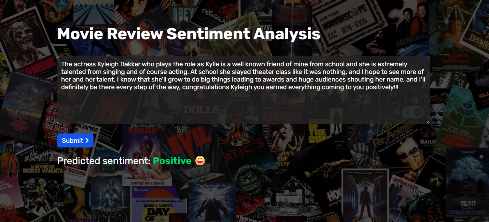

# Sentiment Analysis of Movie Reviews

## Overview
This project aims to predict the sentiment (positive or negative) of movie reviews using machine learning and deep learning models. The best-performing model, an LSTM (Long Short-Term Memory) neural network, achieved an accuracy of approximately **88%**. The project is implemented using Flask for the web interface and model deployment.



## Getting Started

### Installation
1. Clone the repository:
   ```git
   git clone https://github.com/yourusername/movie_review_sentiment_analysis.git
   cd movie_review_sentiment_analysis
   ```
2. Install dependencies:
   ```
   pip install -r requirements.txt
   ```

## Usage
1. Start the Flask server:
   ```
   python app.py
   ```
2. Open a web browser and go to `https://localhost:8080/`.
3. Enter a movie review in the provided form and submit it.
4. The sentiment analysis result (positive or negative) will be displayed.


## Data
The sentiment analysis models were trained and tested on a movie review dataset sourced from [Kaggle](https://www.kaggle.com/datasets/atulanandjha/imdb-50k-movie-reviews-test-your-bert). The data underwent preprocessing, including cleaning and tokenization, before splitting into training and testing sets.

## Models
The project utilized several machine learning and deep learning models, including LSTM for sequence analysis. Training involved optimizing hyperparameters, selecting appropriate loss functions and optimizers, and evaluating model performance using classification metrics.

## Training
Training scripts are provided in the repository for reproducibility. Users can train models with their datasets by following the provided instructions.

## Evaluation
Models were evaluated using standard evaluation metrics such as accuracy, precision, recall, and confusion matrices. ROC curve and Precision-Recall curve is also used to test the best performing model performances. The LSTM model demonstrated superior performance with an accuracy of around 88%.

## Results
The project's results showcase the effectiveness of LSTM for sentiment analysis in movie reviews.

## Future Work
Future work may include experimenting with different architectures, fine-tuning hyperparameters, and integrating with databases for real-time sentiment analysis.

## Contact
For inquiries or support, contact me - mainakcr72002@gmail.com.
